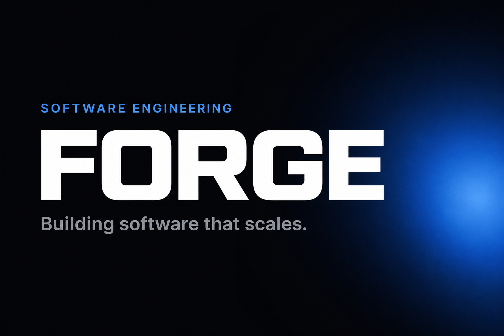
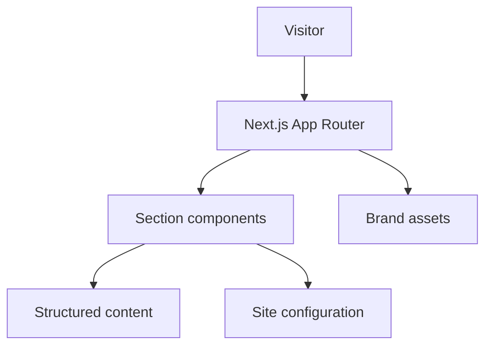

# FORGE

**Software Engineering**

Building software that scales.



---

## Michael Machado

**Founder & Full Stack Software Engineer**

SaaS · AI · Automation · Software Architecture

**Code. Architect. Automate. Scale.**

---

## Value proposition

FORGE is the public professional surface of Michael Machado. It presents how software products are conceived, architected, engineered, documented, and operated — with clarity and restraint.

It is a **portfolio and engineering narrative**, not a multi-tenant SaaS product.

> Status: **MVP / in active development**

**Live site:** [forge.michaelmachado.dev](https://forge.michaelmachado.dev)

---

## Public engineering pillars

| Repository | Role |
| --- | --- |
| [forge](https://github.com/MichaelMachad0/forge) | Professional identity and portfolio site |
| [gia-showcase](https://github.com/MichaelMachad0/gia-showcase) | Public product narrative for the GIA ecosystem |
| [saas-architecture](https://github.com/MichaelMachad0/saas-architecture) | Reference patterns for modular multi-tenant SaaS |
| [ai-automation-examples](https://github.com/MichaelMachad0/ai-automation-examples) | Independent TypeScript examples for AI and automation |

Commercial product source code remains private.

---

## Featured products (positioning only)

| Product | Focus |
| --- | --- |
| **GIA** — Gestão Inteligente e Automatizada | Modular multi-tenant SaaS oriented by AI and automation |
| **SILOG** | Logistics vertical — loads, drivers, vehicles, trips, freight |
| **FinGestor Pro** | Business finance — payables, receivables, cash flow, indicators |
| **Cabe no Bolso** | Personal finance — budget, expenses, goals, planning |
| **Designações** | Assignments, participants, calendar, history, activities |

---

## Architecture (site)



Details: [docs/architecture.md](./docs/architecture.md)

---

## Stack

### This repository (confirmed)

- Next.js (App Router)
- React
- TypeScript (`strict`)
- Node.js
- Tailwind CSS
- Vercel (intended hosting)

Also present: Framer Motion, Lucide, ESLint (`eslint-config-next`).

### Product engineering context

Portfolio narrative also references **PostgreSQL** for SaaS data systems. That is not a runtime dependency of this site.

---

## Quality gates

| Gate | State |
| --- | --- |
| TypeScript strict | Enabled |
| Lint | ESLint + Next.js core-web-vitals / TypeScript |
| Build | `npm run build` |
| Automated tests | Not configured |
| SEO | Metadata API, sitemap, robots, OG |
| Accessibility | Semantic structure; continuous improvement |
| Security | No secrets in repo — [SECURITY.md](./SECURITY.md) |

No CI badge is published without a real workflow.

---

## Brand

Official kit: [docs/brand.md](./docs/brand.md)

- Monogram / favicon: `public/brand/`
- Open Graph: `public/brand/og.png`
- GitHub cover template: `public/brand/github-cover.png`

---

## Links

| Channel | URL |
| --- | --- |
| Site | https://forge.michaelmachado.dev |
| GitHub | https://github.com/MichaelMachad0 |
| LinkedIn | https://www.linkedin.com/in/michael-machado-qa/ |
| Email | contato@forge.michaelmachado.dev |

---

## Documentation

- [Architecture](./docs/architecture.md)
- [Design principles](./docs/design-principles.md)
- [Brand](./docs/brand.md)
- [Roadmap](./docs/roadmap.md)
- [Pinned repositories](./docs/pinned-repositories.md)
- [Portfolio audit](./docs/github-portfolio-audit.md)
- [Publication security checklist](./docs/publication-security-checklist.md)

Governance: [CONTRIBUTING](./CONTRIBUTING.md) · [SECURITY](./SECURITY.md) · [CODE_OF_CONDUCT](./CODE_OF_CONDUCT.md)

---

## Local development

```bash
npm install
npm run dev
```

```bash
npm run lint
npm run build
```

```bash
# .env.local
NEXT_PUBLIC_SITE_URL=https://forge.michaelmachado.dev
```

---

## License

**All Rights Reserved** — see [LICENSE.md](./LICENSE.md).

---

## Versão curta (PT)

FORGE é o portfólio público de Michael Machado. Apresenta identidade profissional, produtos SaaS e pilares públicos de engenharia (`gia-showcase`, `saas-architecture`, `ai-automation-examples`) sem expor código proprietário. Status: MVP.
