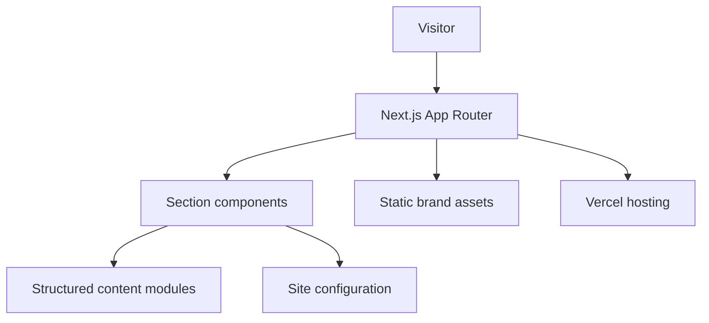
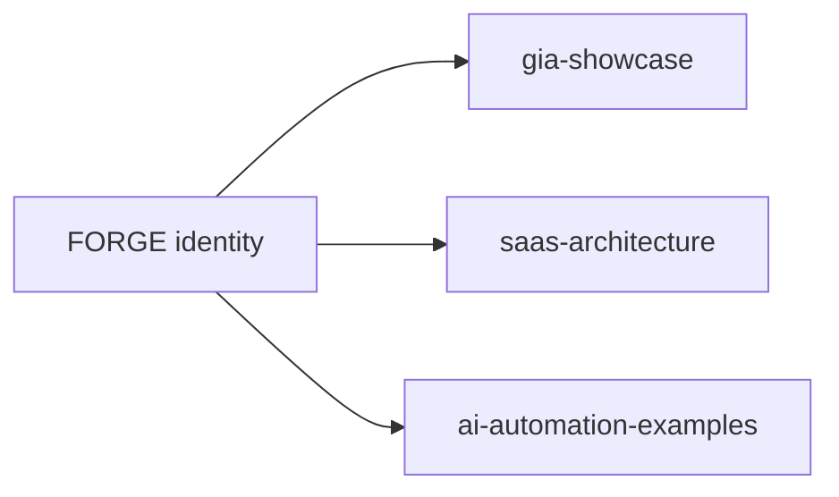

# Architecture

| Field | Value |
| --- | --- |
| **Title** | Architecture |
| **Purpose** | Describe the high-level architecture of the FORGE portfolio site |
| **Scope** | Public `forge` application only — not private SaaS products |
| **Status** | Active (MVP) |
| **Last review** | 2026-07-24 |

## Purpose

Document how the portfolio site is structured so visitors understand boundaries between content, presentation, configuration, and brand assets.

## System overview

## Layers

| Layer | Responsibility |
| --- | --- |
| `src/app` | Routes, layout, metadata, SEO artifacts |
| `src/components` | Layout, sections, UI primitives |
| `src/data` | Structured portfolio content |
| `src/lib` | Site config and utilities |
| `src/types` | Shared TypeScript types |
| `public/brand` | Official static brand kit |

## Ecosystem relationship

FORGE is the identity surface. The other public repositories carry product narrative, architecture reference, and AI examples — without exposing private commercial source.

## Decisions

- Content is data-driven where practical.
- The site is a portfolio surface, not a multi-tenant application.
- Brand assets are versioned under `public/brand/` and documented in `docs/brand.md`.

## Limits

- No database, auth, or multi-tenant runtime in this repository.
- Diagrams omit hosts, secrets, and private product topologies.

## Quality gates (current)

- TypeScript strict
- ESLint (Next.js core-web-vitals + TypeScript)
- Production build via `npm run build`

Automated tests and CI are not yet part of this repository.
