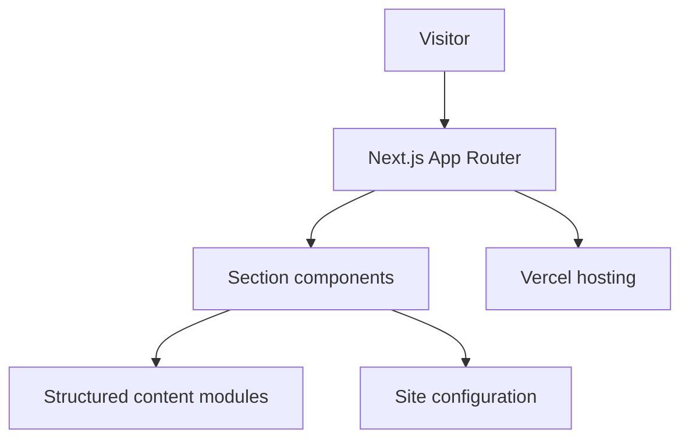

# Architecture

| Field | Value |
| --- | --- |
| **Title** | Architecture |
| **Purpose** | Describe the high-level architecture of the FORGE portfolio site |
| **Scope** | Public `forge` application only — not private SaaS products |
| **Status** | Active (MVP) |
| **Last review** | 2026-07-24 |

## Purpose

Document how the portfolio site is structured so visitors and contributors understand boundaries between content, presentation, and configuration.

## System overview

## Layers

| Layer | Responsibility |
| --- | --- |
| `src/app` | Routes, layout, metadata, SEO artifacts |
| `src/components` | Layout, sections, UI primitives |
| `src/data` | Structured portfolio content (products, projects, skills) |
| `src/lib` | Site config and utilities |
| `src/types` | Shared TypeScript types |

## Decisions

- Content is data-driven where practical so copy changes do not require rewriting layout components.
- The site is a marketing/portfolio surface, not a multi-tenant application.
- Private product backends are intentionally outside this architecture.

## Limits

- No database, auth, or multi-tenant runtime in this repository.
- Diagrams intentionally omit hosting account details, env values, and private product topologies.

## Quality gates (current)

- TypeScript strict
- ESLint (Next.js core-web-vitals + TypeScript)
- Production build via `npm run build`

Automated tests and CI are not yet part of this repository.
