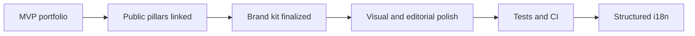

# Roadmap

| Field | Value |
| --- | --- |
| **Title** | Roadmap |
| **Purpose** | Macro directions for the FORGE portfolio surface |
| **Scope** | Public portfolio site and related public documentation |
| **Status** | Living document — no commercial commitments |
| **Last review** | 2026-07-24 |

## Purpose

Share directional intent without dates, SLAs, or sales promises.

## Macro stages

| Stage | Intent | State |
| --- | --- | --- |
| MVP portfolio | Credible brand and product overview site | In progress |
| Public pillars linked | Connect FORGE to showcase / architecture / AI examples | Done (repos public) |
| Brand kit finalized | Versioned monogram, favicon, OG, GitHub cover | In progress |
| Visual and editorial polish | Consistency across README, docs, and assets | In progress |
| Tests and CI | Automated checks when stable enough to maintain | Planned |
| Structured i18n | Deliberate localization strategy | Planned |

## Decisions

- Roadmap items are goals, not contracts.
- Private product delivery roadmaps are out of scope.
- Production outage diagnosis (Vercel) is tracked separately from documentation polish.

## Limits

- No launch dates.
- No revenue or customer targets.
- No claims of production SaaS readiness for FORGE itself.
