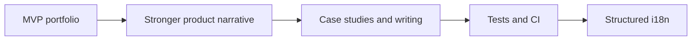

# Roadmap

| Field | Value |
| --- | --- |
| **Title** | Roadmap |
| **Purpose** | Macro directions for the FORGE portfolio surface |
| **Scope** | Public portfolio site and related public documentation |
| **Status** | Living document — no commercial commitments |
| **Last review** | 2026-07-24 |

## Purpose

Share directional intent without dates, SLAs, or sales promises.

## Macro stages

| Stage | Intent |
| --- | --- |
| MVP portfolio | Ship a credible brand and product overview site |
| Stronger product narrative | Align featured products with public showcase docs |
| Case studies and writing | Add architecture and engineering articles without leaking IP |
| Tests and CI | Introduce automated checks when stable enough to maintain |
| Structured i18n | Extract copy into a deliberate localization strategy |

## Decisions

- Roadmap items are goals, not contracts.
- Private product delivery roadmaps are out of scope.

## Limits

- No launch dates.
- No revenue or customer targets.
- No claims of production SaaS readiness for FORGE itself.
